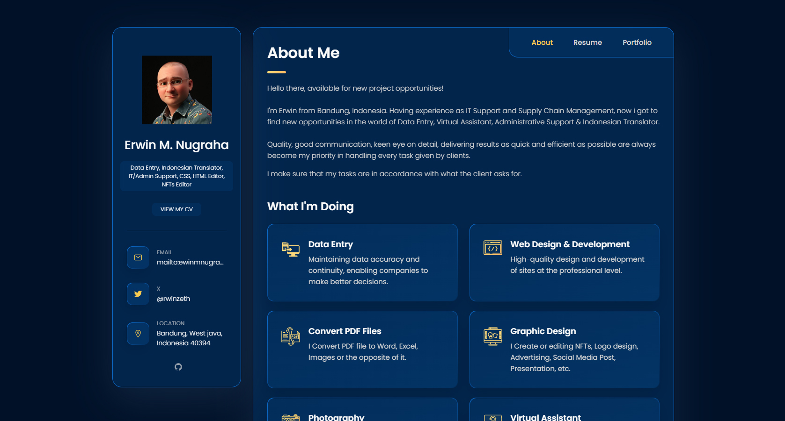

# Personal portfolio v1.0


[](https://twitter.com/intent/follow?screen_name=rwinzeth)

vCard is a fully responsive personal portfolio website, responsive for all devices, built using HTML, CSS, and JavaScript.

## Website Preview
#### Home Page


#### Resume and Porfolio Page


## Features 📋
⚡️ Fully Responsive\
⚡️ Valid HTML5 & CSS3\
⚡️ Easy to modify

## Tools Used 🛠️
* <b>GitHub Pages</b> - To host my static website (HTML, CSS, JS).

## Prerequisites

Before you begin, ensure you have met the following requirements:

* [Git](https://git-scm.com/downloads "Download Git") must be installed on your operating system.

## Installing vCard

To install **vCard**, follow these steps:

Linux and macOS:

```bash
sudo git clone https://github.com/codewithsadee/vcard-personal-portfolio.git
```

Windows:

```bash
git clone https://github.com/codewithsadee/vcard-personal-portfolio.git
```

## Special Thanks

I'd like thanks to [@codewithsadee](https://www.twitter.com/codewithsadee). for this awesome vCard Portfolio 💜

## License
[](http://badges.mit-license.org)
